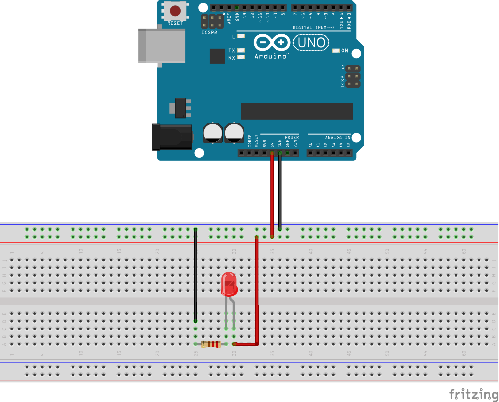

# LED

The wiring shown below will make the LED (Light Emitting Diode) light up. The Arduino is only used as
a power supply. No sketch needs to be uploaded. The 220 Ohm resistor is needed to limit the current
through the LED in order to avoid it from burning out. The polarity of the LED is important. The longer
lead is called *anode* and needs to be connected to the positive voltage while the short lead
(called *cathode*) needs to be connected towards ground. If the LED is connected in reverse the LED
will not light up.

